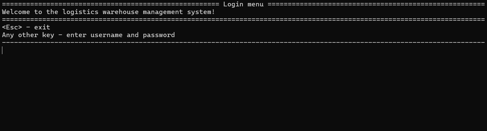
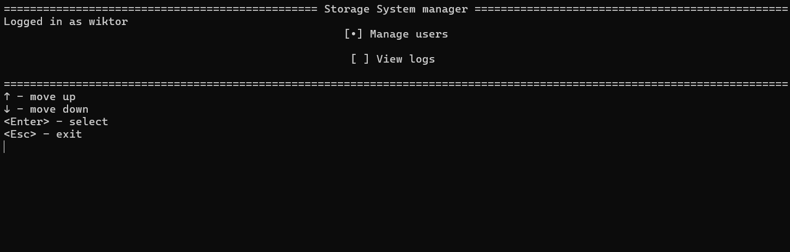

# Dokumentacja projektu Logistics Warehouse Managment System
Nazwa aplikacji: Logistics Warehouse Managment System
Jest to aplikacja do zarządzania magazynem do sklepów.

## Opis projektu

### Cel
Celem projektu było stworzenie prostej aplikacji konsolowej do zarządzania magazynem. Założenie jest takie, że aplikacja ma się znaleźć na komputerze gdzieś w magazynie i korzystają z niej pracownicy magazynu.

### Co robi aplikacja
Aplikacja głównie służy do zatwierdzania importów do magazynu i eksportów do sklepów. Można też rozdzielać zadania między pracowników, a pracownicy mogą te zadania wykonywać.

### Dla kogo jest przeznaczona
Aplikacja jest przeznaczona dla pracowników magazynu.
Są uwzględione role:

Administrator - może zarządzać użytkownikami

Manager - może przydzielać zadania

Pracownik (Warehouseman) - może wykonywać zadania

Logistyk - może przyjmować towar do magazynu i planować eksporty

## Technologie
- Język programowania: C#
- Środowisko: .NET 9
- IDE: Visual Studio 
- Inne biblioteki/narzędzia
  - Microsoft EntityFramework Core - do bazy danych
  - Bogus - do generowania danych

## Struktura katalogów
- `Program.cs` - plik uruchomieniowy, uruchamia główne metody
- `Data/` - foler z danymi, zawiera logi, bazę i hasła użytkowników
- `UsersManagement/` - folder z kodem do zarządzania użytkownikami, hasłami oraz rolami
- `Tests/` - folder z testami jednostkowymi
- `LogServices/` - folder, który zawiera klasę do tworzenia logów
- `database/` - folder, który zawiera schemat bazy (`Model.cs`), metody dostępu do bazy (`Database.cs`) oraz faker danych do tworzenia realistycznych danych (`DataSeeder.cs`)
- `CLI/` - folder z kodem, który pomaga wyświetlić dane na ekranie konsoli
- `Logic/`
  - `Menuhandler.cs` - klasa odpowiedzialna za zarządzanie przełączania się między poszczególnymi menu
  - `screens/` - folder, który zawiera poszczególne menu

## Instrukcja instalacji i uruchomienia

### Wymagania systemowe
- system operacyjny Windows 10
- Visual Studio 2022

### Jak uruchomić aplikację?

1. Rozpakować archiwum zip
2. Wejść do podfolderu `StorageOffice`
3. Otworzyć plik `StorageOffice.sln` przy pomocy Visual Studio 2022
4. Kliknąć "Uruchom" lub użyć skrótu klawiszowego `ctrl`+`F5`
5. Gdyby były problemy z uruchomieniem, należy usunąć foldery `bin/` oraz `obj/` (znajdują się w folderze `StorageOffice`)
   1. przy następnym uruchomieniu, powinny one się utworzyć automatycznie
6. Spróbować uruchomić tak samo jak w punkcie `4.`
7. Gdyby jeszcze nastąpiły problemy należy zainstalować następujące paczki (przez manadżer pakietów NuGet, lub przez [PowerShell](#Komendy)):
   1. Microsoft.EntityFrameworkCore
   2. Microsoft.EntityFrameworkCore.Sqlite
   3. Microsoft.EntityFrameworkCore.Design
   4. Bogus
8. W ostateczności, gdyby foldery `bin/` oraz `obj/` się nie utworzyły należy wykonać następujące kroki:
   1. utworzyć nowy projekt za pomocą Visual Studio 2022
   2. przekopiować tam cały kod (czyli plik `Program.cs`, foldery `classes/`, `Data/` i `Migrations/`)
   3. zainstalować te same paczki co w punkcie `7.`

Do uruchomienia testów należy zrobić te same kroki analogicznie w folderach `StorageOffice.IntegrationsTests` oraz `StorageOffice.UnitTests`

### Komendy

Pobieranie paczek:
```bash
dotnet add package Microsoft.EntityFrameworkCore
dotnet add package Microsoft.EntityFrameworkCore.Sqlite
dotnet add package Microsoft.EntityFrameworkCore.Design
dotnet add package Bogus
dotnet ef database update
```

Dodanie nowej migracji (konieczne po zmianie struktury bazy):
```bash
dotnet ef migrations add <nazwa_migracji>
dotnet ef database update
```

## Zrzuty ekranu



